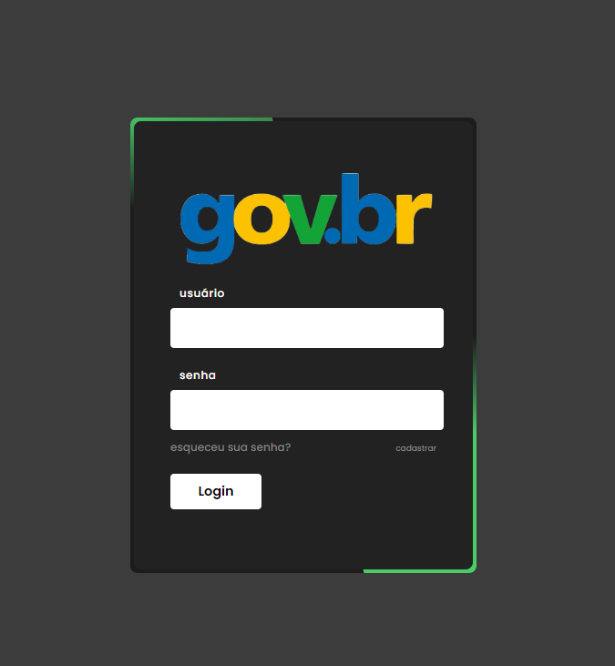

# 📋 Cadastro-gov



## 🚀 Overview 


Este projeto é um aplicativo web baseado em React, que pode ser utilizado no formato mobile ou desktop. Fornece uma interface de login que é visualmente atraente para os usuários cadastrarem suas informações e sua situação socioeconômica. Além disso, incluem login, cadastro e painel de controle cada uma oferecendo conteúdo e funcionalidades diferentes.


## 📋 Requirements

- Node.js (v12 ou posterior)
- npm (v6 ou posterior) ou fio (v1 ou posterior)

## 🔧 Installation

1. Clone o repositório:

```
git clone https://github.com/osmarmcn/registro-gov.git
```

2. Navegue até os diretórios do projeto:

```
cd backend
cd frontend
```


3. Instale as dependências no diretório backend e no frontend:

```
npm install

```


4. Execute o servidor de desenvolvimento no diretório backend:

```
npm start
```

5. Execute o projeto no diretório frotend:

```
npm run dev:mobile
```

6. Baixe a copia do script sql, que está no porjeto, para utilizar no Myslq workbench:

```
registro.sql
```

## 🛠️  Estrutura do Projeto

- Login.jsx: A página login, em que está a interface do projeto vai direcionar as outras páginas, para qual for conformidade necessária que deseja o usuário.Uma interface atrativa com uma imagem  para que se designa o projeto. Inclui  botões para navegar até as seções desejada. 
- Cadastro.jsx: A página cadastro, é onde será feita a coleta e verficação dos dados do usuário, caso sejam validos e existente no sistema. Uma tela facil e intuitiva para seu preenchimento, ao final gera um pdf com suas informações.
- Dashboard.jsx: A página que o usuário interage com aplicativo.


## 📄 Licença

- Este projeto está licenciado sob a [MIT License](LICENSE).
